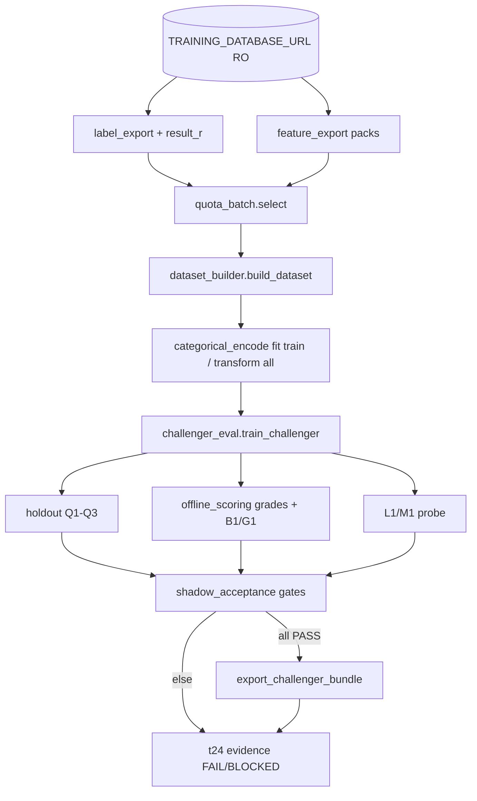

# Challenger Quality V1 — Design

**Spec**: `.specs/features/challenger-quality-v1/spec.md`  
**Context**: `.specs/features/challenger-quality-v1/context.md`  
**Status**: Approved (user: confirmado / pode seguir — 2026-08-12)

---

## Architecture Overview

Offline-only pipeline extension in `maxxtrading-model-training`. No Score Engine
runtime changes except a **docs pointer**. Data flow:



Limits signed in `docs/shadow-acceptance.md` remain the only numeric gates.

---

## Code Reuse Analysis

### Existing Components to Leverage

| Component | Location | How to Use |
| --- | --- | --- |
| Smoke assemble | `src/training/smoke_export.py` | Extend or call from quality entry; keep soft vectorize |
| Dataset splits | `src/training/dataset_builder.py` | Unchanged temporal split; feed quota-selected samples |
| Vectorize | `src/training/vectorize.py` | Numerical order; cats added via encoder matrices |
| Challenger eval | `src/training/challenger_eval.py` | Reuse train/holdout/probe/gate; wire B1/G1 inputs |
| Shadow criteria | `src/training/shadow_acceptance.py` | Unchanged thresholds |
| Bundle export | `src/training/artifact_bundle.py` | Already supports `encoder.pkl` + sha |
| OneHot pattern | `tests/test_artifact_bundle.py` | Mirror sklearn `OneHotEncoder` usage |
| SE thresholds | `/workspace/app/artifacts/thresholds.json` (RO path) | Offline grade mirror only |

### Integration Points

| System | Integration Method |
| --- | --- |
| Nest `public.trade_samples` | SELECT via existing label_export (+ `result_r` column) |
| Indicator packs | Existing feature_export |
| Score Engine FD / thresholds | Read-only filesystem paths; never import SE Python |
| MLflow registry | **Out of scope** (T25) |

---

## Components

### `QuotaSpec` + `select_quota_batch`

- **Purpose**: Enforce minimum full-vector counts per temporal partition before `n_max` global fill.
- **Location**: `src/training/quota_batch.py`
- **Interfaces**:
  - `QuotaSpec(train_min, validation_min, holdout_min, n_max)` — holdout_min ≥ 200
  - `select_quota_batch(labels, packs, feature_order, splits, quotas) -> QuotaBatchResult`
  - Fail closed if any quota unmet → `QuotaBatchError` with sanitized counts
- **Dependencies**: label/pack types, feature_order names, split datetimes
- **Reuses**: soft full-vector check from smoke (`all names in pack.features` for numerical; cats checked after encode path or raw presence)

### `quality_export` (or extended `run_export_smoke`)

- **Purpose**: Entry that applies quotas + revised window defaults for CQ runs.
- **Location**: `src/training/quality_export.py` (prefer new module to avoid breaking T8 smoke)
- **Interfaces**:
  - `run_quality_export(engine, *, window…, quotas, feature_dictionary_path, include_categoricals=True) -> ExportSmokeReport`-compatible report
- **Dependencies**: quota_batch, label_export, feature_export, dataset_builder, vectorize
- **Reuses**: `_assemble_smoke` patterns; may factor shared helpers if needed without drive-by refactors

### Label `result_r`

- **Purpose**: Enable honest B1.
- **Location**: `src/training/label_export.py` (extend `LabeledTradeSample` + SELECT)
- **Interfaces**: optional `result_r: float | None` on sample
- **Reuses**: existing RO query guards

### `categorical_encode`

- **Purpose**: Fit OneHot (or equivalent) on **train only**; transform val/holdout; missing cat → sample excluded.
- **Location**: `src/training/categorical_encode.py`
- **Interfaces**:
  - `fit_transform_categoricals(train_rows, cat_names) -> (encoder, matrix)`
  - `transform_categoricals(encoder, rows, cat_names) -> matrix | skip ids`
- **Dependencies**: sklearn
- **Reuses**: artifact_bundle encoder slot

### `offline_scoring`

- **Purpose**: Mirror SE grade boundaries enough for B1/G1 using `thresholds.json` + `probabilityWin` (+ expectedR/confidence defaults documented).
- **Location**: `src/training/offline_scoring.py`
- **Interfaces**:
  - `load_thresholds(path) -> Thresholds`
  - `grade_from_probability(prob, thresholds, *, expected_r, confidence) -> "A"|"B"|"C"`
  - `business_proxy_delta(challenger_grades, baseline_grades, result_r) -> float | None`
  - `max_grade_share_delta_pp(challenger_shares, baseline_shares) -> float`
- **Dependencies**: JSON thresholds schema as in SE artifacts
- **Reuses**: formulas documented in SE AD-006 / thresholds.json (copied as pure functions — no SE imports)

### Challenger eval wiring

- **Purpose**: Compute B1/G1 inside evaluate path when rows carry grades/R; refuse PASS if any criterion fails.
- **Location**: `src/training/challenger_eval.py` (extend)
- **Reuses**: existing `gate_challenger_metrics` / `overall_verdict`

### Docs

- **Purpose**: Heavy/real evidence refresh + SE pointer.
- **Location**: `docs/t24-challenger-eval-evidence.md`; SE `docs/mlflow/challenger-quality-v1-pointer.md`

---

## Data Models

### `QuotaSpec`

```python
@dataclass(frozen=True)
class QuotaSpec:
    train_min: int
    validation_min: int
    holdout_min: int  # >= 200
    n_max: int
```

### Extended `LabeledTradeSample`

```python
# add:
result_r: float | None = None
```

### `OfflineGradeRow`

```python
@dataclass(frozen=True)
class OfflineGradeRow:
    sample_id: str
    probability_win: float
    grade: str  # A|B|C
    result_r: float | None
```

---

## Error Handling Strategy

| Error Scenario | Handling | User Impact |
| --- | --- | --- |
| Quota unmet | `QuotaBatchError` + counts | Evidence STOP; no fake dataset_id |
| Holdout < 200 | BLOCKED before metrics | Same as shadow-acceptance |
| Missing categorical | Skip sample / fail quota if shortfall | Fail closed |
| Missing thresholds.json | B1/G1 FAIL | overall FAIL |
| Missing result_r for grade-A | B1 FAIL | overall FAIL |
| Non-readonly DB | Refuse Heavy/real | Abort |
| Any gate FAIL | No bundle export | Evidence records FAIL |

---

## Risks & Concerns

| Concern | Location | Impact | Mitigation |
| --- | --- | --- | --- |
| Smoke global top-N starves train | `smoke_export.py` assemble | AUC~0.5 | New `quota_batch` + `quality_export`; leave T8 smoke intact |
| Offline grade ≠ live SE SignalEvaluator | SE scoring chain | B1/G1 drift | Document mirror + formulas; use same thresholds.json; P3 serving probe later |
| thresholds.json only lists grades A/B | `thresholds.json` | C = else | Explicit C as default when not A/B |
| `result_r` null dense | Nest rows | B1 FAIL | Fail closed per spec; don't invent R |
| File growth / 200–300 line rule | new modules | Maintainability | Keep quota/encode/scoring in separate files |
| SE pointer needs SE claim | SE repo | Process | Separate short docs commit with user AUTH already for 5B |

---

## Tech Decisions

| Decision | Choice | Rationale |
| --- | --- | --- |
| New `quality_export` vs mutate smoke | **New module** | Preserve T8 evidence reproducibility |
| Categorical encoding | sklearn `OneHotEncoder(handle_unknown='ignore')` fit on train | Matches bundle tests; deterministic |
| Default quotas (agent discretion) | train_min=800, validation_min=200, holdout_min=200, n_max=5000 | Operational; Design may lower only if RO audit proves scarcity — never holdout < 200 |
| Revised window | Keep T8 calendar ends initially; move `train_end` later (e.g. toward mid validation) in quality defaults **recorded in manifest** | User 1C; exact dates finalized in T2 after optional RO histogram |
| Baseline for L1 peer | Keep peer LGBM | Spec assumption; P3 deferred |
| Project AD | Append training AD-T01: quality datasets must use quota_batch + never shrink FD | STATE.md |

---

## Project decision (STATE.md)

See `AD-T01` in `.specs/STATE.md`: quota + full FD numerical-12 + included cats for CQ datasets; never relax shadow-acceptance-v1.
